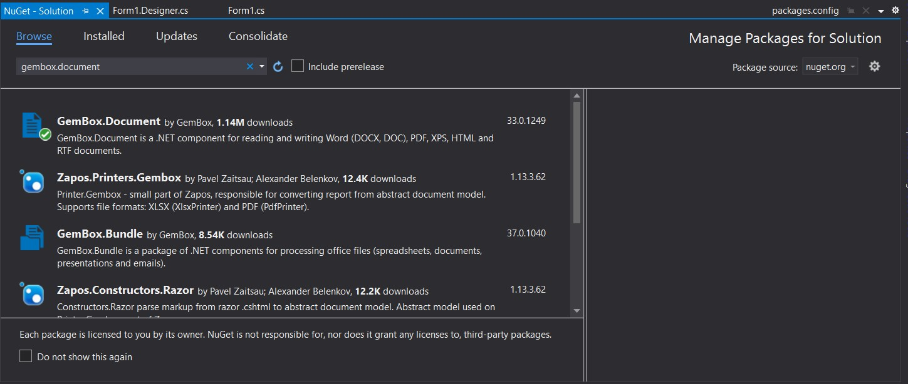
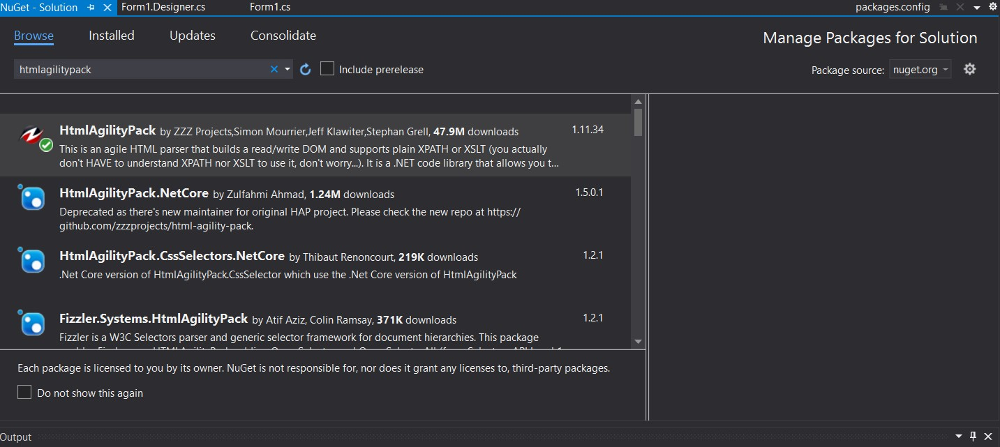
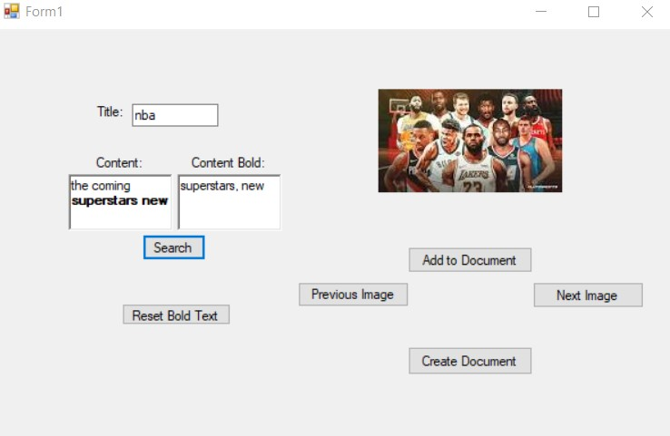
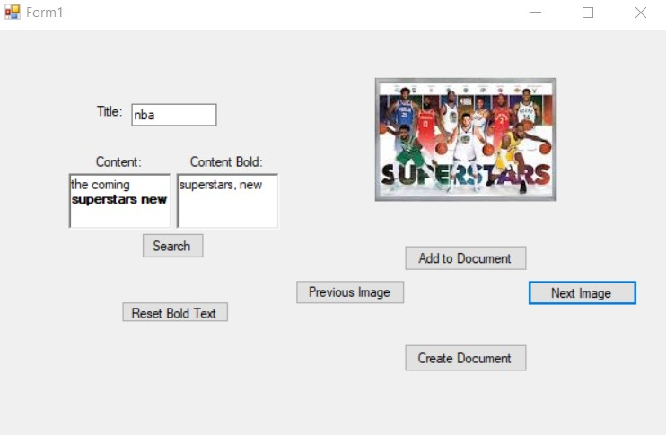
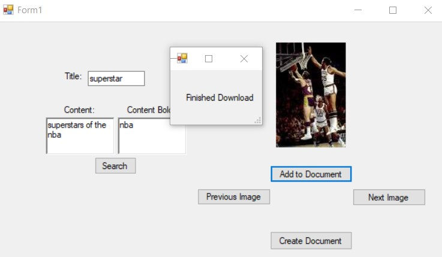
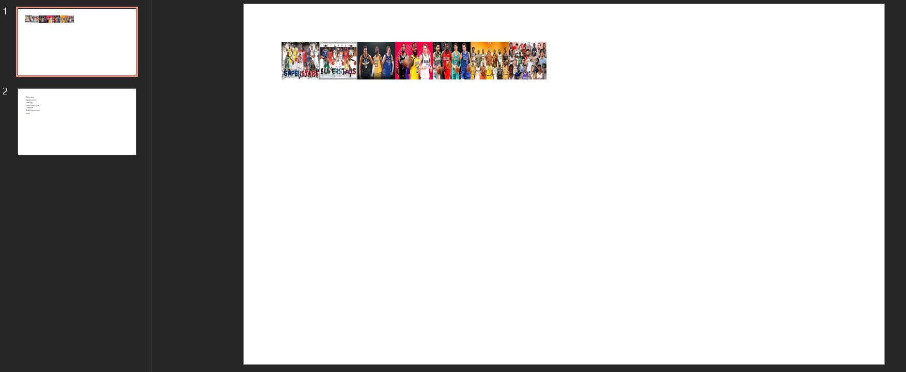
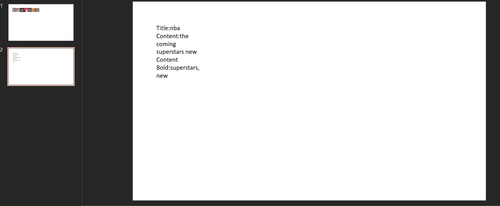

# TestforSEH_imagesearchtodoc

## Table of Contents
* Project
* Installation
* How it Works
* Review Code/Documentation

## Project
This project was to complete the following features:

* Bonus Feature: This project allows multiple images from multiple searches to be shown inside a single document

* Create a solution that accepts user input and generates a power point slide (or other document which accepts images/text)
* Have a Title area
* Have a Text area
* Have a image suggestion area that utilizes words in the title, and bold words in the text area to bring suggested images in, with ability to select multiple images to include in the document

## Installation

* Built on .NET framework 4.7
* Uses gemboxsoftware link contains instructions to download into visual studio using (https://www.gemboxsoftware.com/document/examples/c-sharp-vb-net-word-pdf-library/801) for creating and manipulating .docx documents. You can also download through nuget package manager in visual studio make sure to install GemBox.Document

* Uses HtmlAgilityPack to obtain src to images instructions to download https://www.nuget.org/packages/HtmlAgilityPack/ or use Nuget package manager in visual studio to download

## How It Works

1. Download through git or download zip file and unpack onto laptop
2. Open project file (\WindowsFormsApp2\WindowsFormsApp2.csproj) from visual studio
3. Start the software.
4. Popup Opens as seen here, In order for the bold to work it must map to a word in the content textbox. To get multiple words bolded seperate then by "," in the content bold textbox. Then after clicking search you will see the text changed to bold. Click the reset to change the content.

4. Insert content into Title, Content, and Content Bold textboxes then click search.
5. Change images by clicking "Next Image" and "Previous Image".

6. Add that image to the document by clicking on "Add to Document" then after choosing which images to show click "Create Document".

7. Find the document named powerpoint.pptx inside \WindowsFormsApp2\bin\Debug 

## Review Code/Documentation

Form1.cs - WindowsForm which contains all functions to work app 
popupwindowdoc.cs - WindowsForm which contains popup to show when creating document or adding images to documentS

    private void Search_Button_Click(object sender, EventArgs e)

<ul>
<li>desc: Function to search google images based on title and content bold words and display the first image.</li>
<li>parameters: sender, event</li>
<li>returns: list urls which contains images found from search</li>
</ul>

    private void AddtoDocument_Button_Click(object sender, EventArgs e)

<ul>
<li>desc: Works the "Add to Document" button by adding the current image from the url list to a new list named urls_save.</li>
<li>parameters: sender, event</li>
<li>returns: list urls_save which contains images going to be added to document.</li>
</ul>

    private void NextImage_Button_Click(object sender, EventArgs e)

<ul>
<li>desc: Works the "Next Image" button by changing the image shown to the next index.</li>
<li>parameters: sender, event</li>
<li>returns: new image displayed.</li>
</ul>

    private void PreviousImage_Button_Click(object sender, EventArgs e)

<ul>
<li>desc: Works the "Previous Image" button by changing the image shown to the previous index.</li>
<li>parameters: sender, event</li>
<li>returns: new image displayed.</li>
</ul>

    private void CreateDocument_Button_Click(object sender, EventArgs e)

<ul>
<li>desc: Works the "Create Document" button by saving the images along with content into a docx file.</li>
<li>parameters: sender, event</li>
<li>returns: docx file saved.</li>
</ul>
