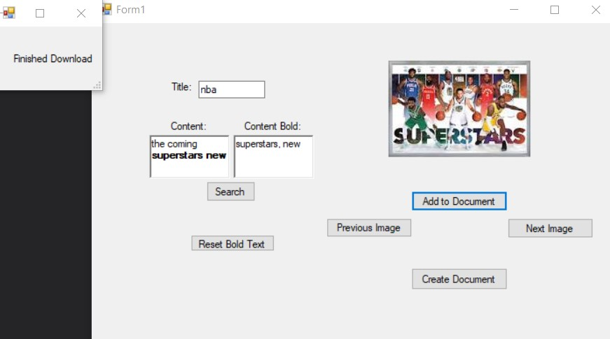

# TestforSEH_imagesearchtodoc

This project was to complete the following features:

* Create a solution that accepts user input and generates a power point slide (or other document which accepts images/text)
* Have a Title area
* Have a Text area
* Have a image suggestion area that utilizes words in the title, and bold words in the text area to bring suggested images in, with ability to select multiple images to include in the document

## Installation

* Built on .NET framework 4.7
* Uses gemboxsoftware (https://www.gemboxsoftware.com/document/examples/c-sharp-vb-net-word-pdf-library/801) for creating and manipulating .docx documents

## How It Works

1. Download through git or download zip file and unpack onto laptop
2. Open project file (\WindowsFormsApp2\WindowsFormsApp2.csproj) from visual studio
3. Start the software.
4. Popup Opens as seen here: 

4. Insert content into Title, Content, and Content Bold textboxes then click search.
5. Change images by clicking "Next Image" and "Previous Image".

6. Add that image to the document by clicking on "Add to Document" then after choosing which images to show click "Create Document".

7. Find the document named Pictures.docx inside \WindowsFormsApp2\bin\Debug 

